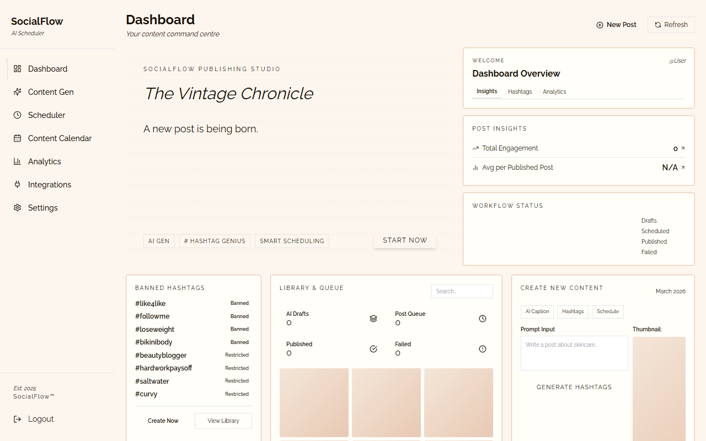
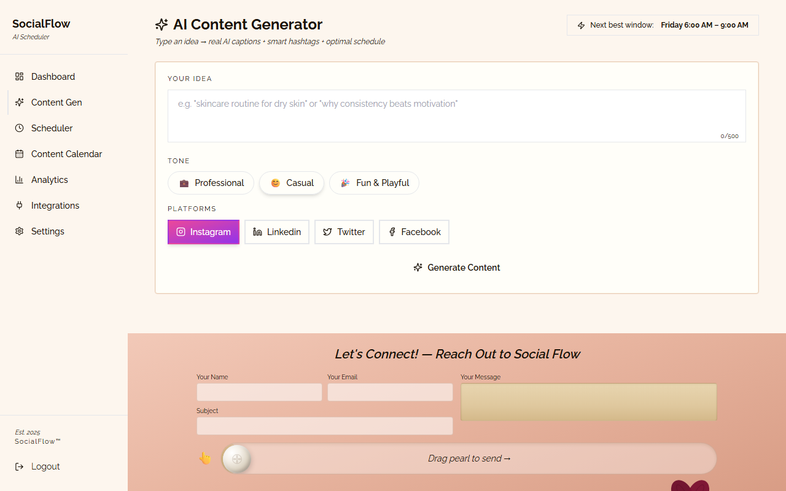
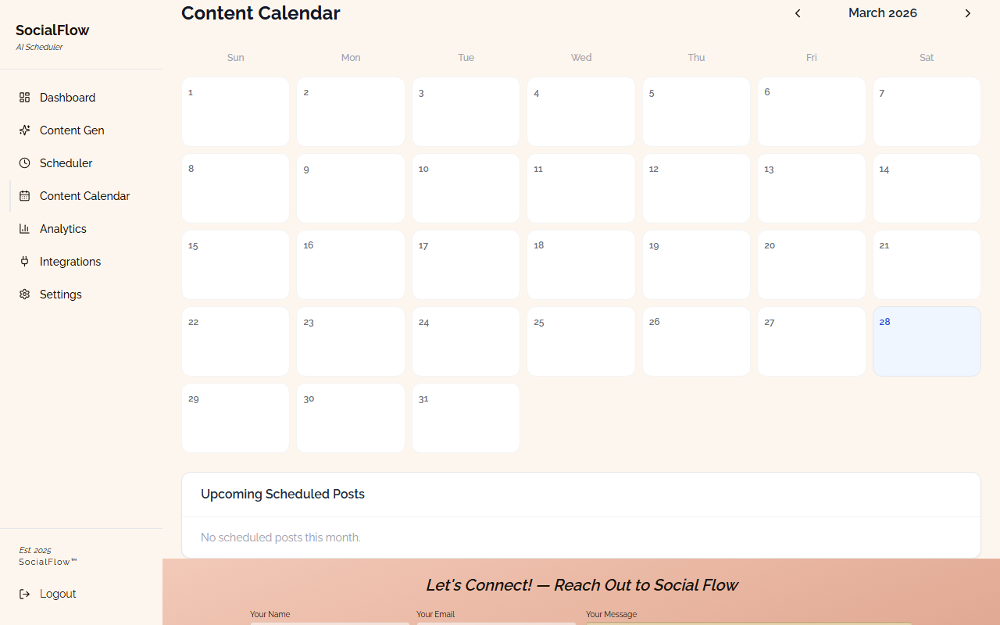
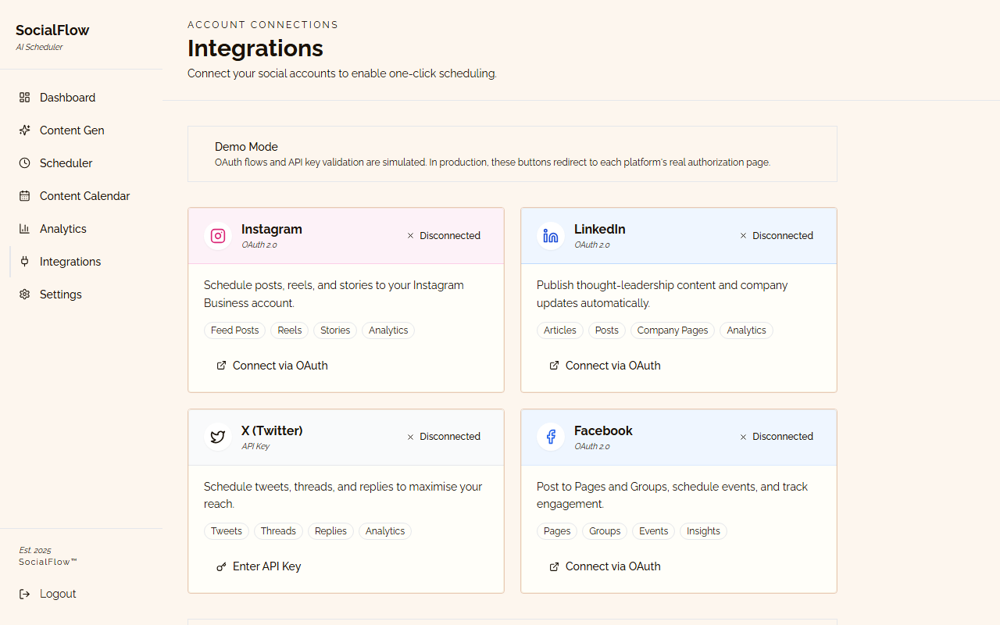

<div align="center">

# SocialFlow

### AI-Powered Social Media Scheduler

*Plan · Generate · Schedule · Publish — all in one vintage-editorial dashboard*

[](https://nextjs.org)
[](https://fastapi.tiangolo.com)
[](https://supabase.com)
[](https://tailwindcss.com)

</div>

---

## Screenshots

<table>
  <tr>
    <td><b>Dashboard</b></td>
    <td><b>AI Content Generator</b></td>
  </tr>
  <tr>
    <td></td>
    <td></td>
  </tr>
  <tr>
    <td><b>Content Calendar</b></td>
    <td><b>Integrations</b></td>
  </tr>
  <tr>
    <td></td>
    <td></td>
  </tr>
</table>

---

## Features

| Feature | Description |
|---|---|
| **AI Caption Generator** | Enter an idea, pick a tone & platforms — get 4–6 caption variations with hook, body, and CTA via Mistral-7B |
| **Per-Platform Adapter** | One click rewrites any caption for Instagram, LinkedIn, Twitter/X, or Facebook |
| **Best Time Engine** | Research-backed scoring returns top 3 posting windows with engagement lift % |
| **AI Hashtag Generator** | 8–12 hashtags categorised by reach (high / medium / niche) |
| **Content Scheduler** | Pick date, time, and platforms — APScheduler auto-publishes every minute |
| **Content Calendar** | 31-day grid with platform colour dots and engagement heatmap overlay |
| **Analytics Dashboard** | Scheduled, published, reach, and engagement stats broken down by platform |
| **Integrations** | OAuth 2.0 (Instagram, LinkedIn, Facebook) + API key (Twitter/X) |
| **Contact Footer** | Drag-to-send pearl interaction on every page |

---

## Tech Stack

```
Browser  →  Next.js 14 (App Router)  ·  Tailwind CSS  ·  React Query  ·  Zustand
                              ↕  REST / JSON  (JWT Bearer)
Backend  →  FastAPI  ·  APScheduler  ·  Mistral-7B via HuggingFace
                              ↕  Supabase Client
Database →  Supabase  (PostgreSQL + Auth + RLS)
```

| Layer | Technology |
|---|---|
| Frontend | Next.js 14, Tailwind CSS, TanStack React Query, Zustand, Axios |
| Backend | FastAPI, Pydantic v2, APScheduler, httpx, Uvicorn |
| Database | Supabase (PostgreSQL + Row-Level Security) |
| AI | Mistral-7B-Instruct via Hugging Face Inference API |
| Platforms | Instagram Graph API, LinkedIn UGC API, Twitter API v2, Facebook Graph API |

---

## Quick Start

### Prerequisites
- Node.js 18+
- Python 3.11+
- A [Supabase](https://supabase.com) project (free tier works)

### 1 — Clone & configure

```bash
git clone https://github.com/Hackerette0/Social-media-scheduler.git
cd Social-media-scheduler

# Backend env
cp backend/.env.example backend/.env
# Fill in your Supabase + HuggingFace keys (see below)

# Frontend env
cp frontend/.env.example frontend/.env.local
```

### 2 — Set up the database

1. Create a free project at [supabase.com](https://supabase.com)
2. Open **SQL Editor** → run `supabase/schema.sql`
3. Copy your **Project URL**, **anon key**, and **service_role key** into `backend/.env`

### 3 — Run with Docker

```bash
docker-compose up --build
```

- Frontend → http://localhost:3000
- API docs → http://localhost:8000/docs

### 4 — Run locally

**Backend:**
```bash
cd backend
python -m venv venv
source venv/bin/activate        # Windows: venv\Scripts\activate
pip install -r requirements.txt
uvicorn app.main:app --reload
```

**Frontend:**
```bash
cd frontend
npm install
npm run dev
```

---

## Environment Variables

### `backend/.env`

```env
SUPABASE_URL=https://your-project.supabase.co
SUPABASE_KEY=your-anon-key
SUPABASE_SERVICE_KEY=your-service-role-key
SECRET_KEY=any-random-secret-string
HUGGINGFACE_API_KEY=hf_...          # optional — enables AI captions
INSTAGRAM_ACCESS_TOKEN=             # optional
LINKEDIN_ACCESS_TOKEN=              # optional
TWITTER_API_KEY=                    # optional
FACEBOOK_ACCESS_TOKEN=              # optional
```

### `frontend/.env.local`

```env
NEXT_PUBLIC_API_URL=http://localhost:8000/api/v1
```

> **No API keys?** The app runs in demo mode — AI features fall back to a rich template engine, so everything still works.

---

## API Reference

| Method | Endpoint | Description |
|---|---|---|
| POST | `/api/v1/auth/register` | Create account |
| POST | `/api/v1/auth/login` | Login → JWT token |
| GET | `/api/v1/posts` | List posts |
| POST | `/api/v1/posts` | Create / schedule post |
| PATCH | `/api/v1/posts/{id}` | Update post |
| DELETE | `/api/v1/posts/{id}` | Delete post |
| POST | `/api/v1/captions/generate` | Generate caption variations |
| POST | `/api/v1/captions/adapt` | Adapt caption for platform |
| POST | `/api/v1/captions/best-times` | Get top posting windows |
| POST | `/api/v1/hashtags/generate` | Generate hashtags |
| GET | `/api/v1/analytics/dashboard` | Dashboard stats |

All endpoints except `/auth/*` require `Authorization: Bearer <token>`.

Interactive docs available at `http://localhost:8000/docs`.

---

## Project Structure

```
Social-media-scheduler/
├── backend/
│   ├── app/
│   │   ├── api/routes/      # auth, posts, captions, hashtags, analytics
│   │   ├── core/            # config, security, supabase client
│   │   ├── models/          # Pydantic schemas
│   │   ├── services/        # caption_service, hashtag_service, publishers
│   │   └── tasks/           # APScheduler polling job
│   ├── requirements.txt
│   └── Dockerfile
├── frontend/
│   ├── src/
│   │   ├── app/
│   │   │   ├── (auth)/      # login, register
│   │   │   └── (dashboard)/ # dashboard, content-gen, compose,
│   │   │                    # calendar, analytics, integrations, settings
│   │   ├── components/ui/   # TypewriterHero, shared components
│   │   └── lib/             # api.ts, bestTimes.ts, store, utils
│   ├── tailwind.config.ts
│   └── Dockerfile
├── supabase/
│   └── schema.sql
├── docker-compose.yml
└── PRODUCT_DOCUMENT.md
```

---

## Design System

SocialFlow uses a vintage / editorial aesthetic with a custom Tailwind theme:

| Token | Value | Usage |
|---|---|---|
| `cream` | `#F5F0E8` | Page backgrounds |
| `paper` | `#FDFAF4` | Card backgrounds |
| `forest` | `#2C4A3E` | Sidebar, primary buttons |
| `gold` | `#C9A84C` | Accents, active nav |
| `ink` | `#1C1C1E` | Primary text |
| `sage` | `#7A9E8E` | Secondary text |

Typography: **Playfair Display** (headings) · **Bebas Neue** (accent) · **Raleway** (body) · **Courier Prime** (mono)

---

<div align="center">

*SocialFlow™ · Built with FastAPI + Next.js · Est. 2025*

</div>
